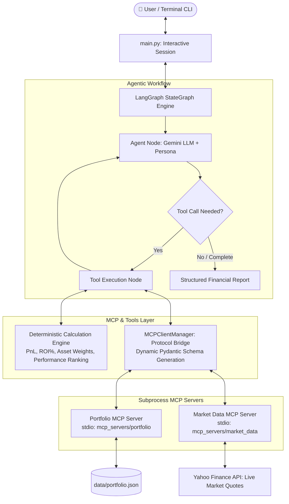

# 📊 Financial Portfolio Advisor Agent

An intelligent, autonomous **AI Financial Portfolio Advisor** built with **LangGraph**, **Model Context Protocol (MCP)**, and **Google Gemini**. 

The system connects live market data from Yahoo Finance and private portfolio holdings through standardized MCP servers, executes deterministic financial calculations to eliminate mathematical hallucinations, and delivers structured portfolio analysis through an interactive multi-turn conversational interface.

---

## 🏗️ Architecture Overview



---

## ✨ Key Features

- **Zero-Hallucination Directives**: The agent never invents prices, share quantities, or buy prices. All data is dynamically fetched from MCP servers.
- **Deterministic Math Engine**: Computations for total invested value, current market value, unrealized profit & loss, percentage ROI, asset weights, and performance attribution are computed mathematically via deterministic Python functions, avoiding LLM arithmetic errors.
- **Model Context Protocol (MCP) Standards**: Decouples data sources from the agent logic. Exposes holdings, transaction history, and real-time market data via standard FastMCP servers running over stdio.
- **Dynamic Pydantic Schema Generation**: Automatically transforms MCP tool JSON schemas into Pydantic models with typed signatures, guaranteeing argument validation between Gemini and MCP endpoints.
- **Multi-Turn Conversational Memory**: Retains dialogue context across successive turns, enabling natural follow-up inquiries (e.g., *"Which of those has the highest buy price?"* or *"What is my tech exposure?"*).
- **Interactive CLI & Slash Commands**: Includes quick command shortcuts (`/overview`, `/quote <ticker>`, `/clear`, `/help`, `/exit`) and Windows UTF-8 terminal support.

---

## 📁 Project Structure

```text
Finance_PortFolio_Agent/
├── app/
│   ├── core/
│   │   ├── config.py             # Pydantic Settings & environment variables
│   │   └── mcp_client.py         # MCP Client Manager & dynamic tool schema bridge
│   ├── graph/
│   │   ├── nodes.py              # Agent reasoning & tool nodes
│   │   ├── state.py              # LangGraph AgentState TypedDict schema
│   │   └── workflow.py           # StateGraph compilation & edge routing
│   ├── prompts/
│   │   └── system_prompt.py      # Financial Advisor persona & guardrails
│   └── tools/
│       ├── calculations.py       # Deterministic PnL, ROI, & portfolio metrics
│       └── portfolio_tools.py    # LangChain tool wrappers for calculation engine
├── data/
│   └── portfolio.json            # User portfolio data (cash balance, holdings, transactions)
├── mcp_servers/
│   ├── market_data/
│   │   ├── server.py             # FastMCP server for live Yahoo Finance data
│   │   └── tools.py              # Quote fetching & historical price bars
│   └── portfolio/
│       ├── server.py             # FastMCP server for portfolio queries
│       └── tools.py              # Holdings, transactions, and account summaries
├── tests/
│   ├── test_calculations.py      # Unit tests for deterministic math functions
│   ├── test_portfolio_mcp.py     # Standalone MCP portfolio server test
│   ├── test_market_mcp.py        # Standalone MCP market data server test
│   ├── test_mcp_langchain.py     # LangChain tool-binding validation
│   ├── test_agent_graph.py       # End-to-end LangGraph agent integration test
│   └── test_cli_smoke.py         # Multi-turn conversational memory smoke test
├── .env.example                  # Template for environment variables
├── .gitignore                    # Git exclusions (virtual env, logs, cache)
├── main.py                       # Application entrypoint & interactive CLI
├── requirements.txt              # Core project dependencies
└── README.md                     # Project documentation
```

---

## 🚀 Getting Started

### 1. Prerequisites
- Python 3.10 to 3.13 installed.
- A Google Gemini API Key ([Get an API key here](https://aistudio.google.com/)).

### 2. Clone the Repository
```bash
git clone https://github.com/Sairaj062003/Finance_PortFolio_Agent.git
cd Finance_PortFolio_Agent
```

### 3. Create Virtual Environment & Install Dependencies
```powershell
# Create virtual environment
python -m venv .venv

# Activate virtual environment (Windows PowerShell)
.\.venv\Scripts\Activate.ps1

# Install requirements
pip install -r requirements.txt
```

### 4. Configure Environment Variables
Copy `.env.example` to `.env` and add your Gemini API key:
```ini
GEMINI_API_KEY=your_gemini_api_key_here
DEFAULT_MODEL=gemini-3.5-flash
```

---

## 💬 Usage

### Launch Interactive Agent
Start the interactive terminal CLI:
```powershell
python main.py
```

### Quick Commands:
- `/overview` - Generates a complete portfolio valuation, PnL, allocation table, and analysis report.
- `/quote <symbol>` - Fetches real-time price, daily change, and previous close for a stock (e.g., `/quote AAPL`).
- `/clear` - Resets current conversation context to start fresh.
- `/help` - Shows help details and sample questions.
- `/exit` or `/quit` - Closes MCP servers cleanly and exits.

### Example Prompts:
- *"Give me an overview of my current portfolio performance."*
- *"What is my largest stock position by market value?"*
- *"How much cash do I have available, and what percentage of my portfolio is in cash?"*
- *"What is the latest price of NVDA, and how does today's change affect my portfolio?"*

---

## 🧪 Testing & Verification

Run unit tests and verification suites:

### 1. Unit Tests (Deterministic Calculations)
```powershell
pytest tests/test_calculations.py -v
```

### 2. Multi-Turn Conversation Smoke Test
```powershell
python tests/test_cli_smoke.py
```

### 3. End-to-End Agent Workflow Test
```powershell
python tests/test_agent_graph.py
```

---

## ⚖️ Regulatory & Compliance Disclaimer

> *Disclaimer: This software and its AI-generated analyses are for informational and educational purposes only. They do not constitute formal financial, investment, or tax advice. Always consult a licensed financial advisor before making any investment decisions.*
